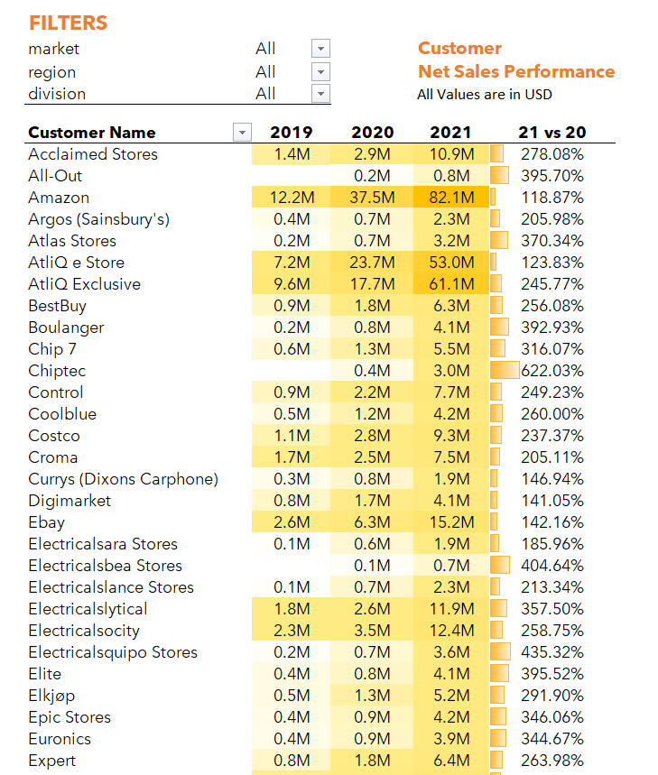
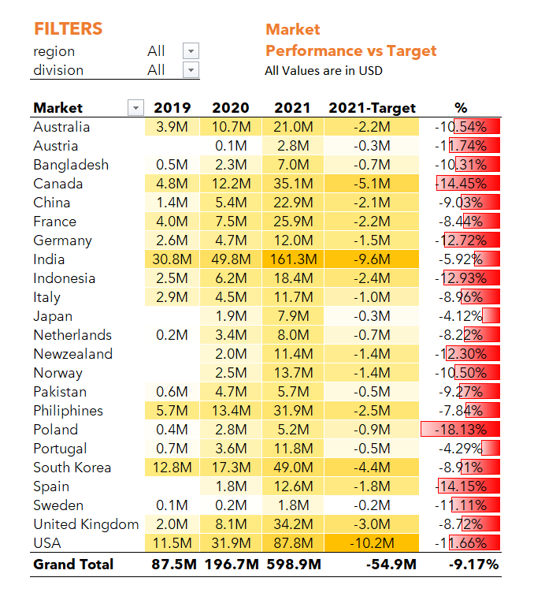
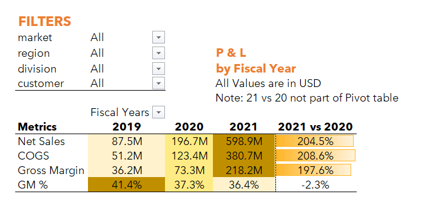
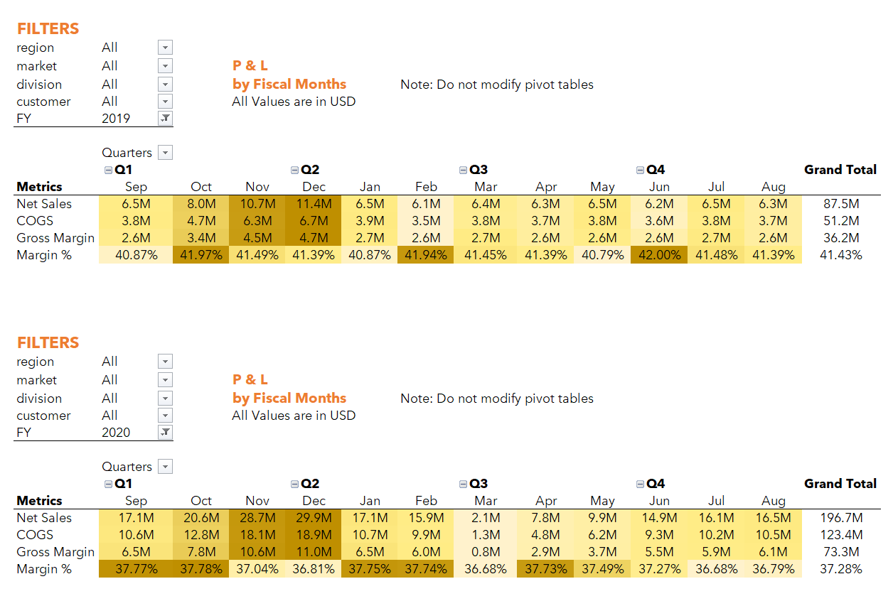
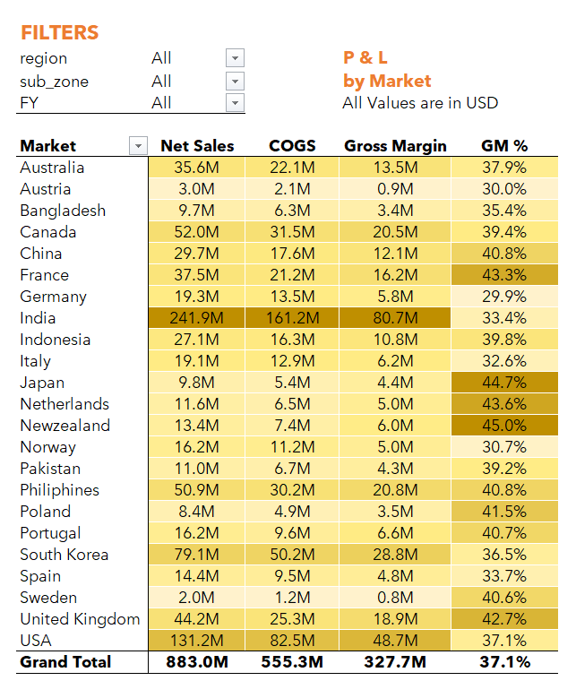

# Excel : Sales-Analytics-Project 
### Excel | Power Query | Data Modeling | Power Pivot
## 📌 Project Overview
This project demonstrates an end-to-end Sales & Financial analytics solution built using large-scale real-world data (~800,000 records).

The objective was to transform raw CSV data into meaningful business insights through data cleaning, modeling, and reporting.

⚠️ Note: Due to data confidentiality, the dataset is not included. Only report outputs and methodology are shared.

---

## 🧰 Tools & Technologies
- Excel Power Query (ETL)
- Power Pivot (Data Modeling)
- DAX (Data Analysis Expressions)
- Pivot Tables & Dashboards
- CSV Files

---

## 🔄 Data Processing (ETL)
- Extracted multiple CSV files using Power Query
- Performed data cleaning:
  - Removed nulls and inconsistencies
  - Standardized formats
- Created a **Calendar Table**
- Derived:
  - Fiscal Year
  - Fiscal Month
  - Fiscal Quarter

---

## 🧱 Data Modeling
- Built a structured **data model in Power Pivot**
- Established relationships between:
  - Fact Table (Sales Data)
  - Dimension Tables (Customer, Market, Product, Date)
- Optimized performance for handling ~800K rows

---

## 📐 DAX Measures
- Total Sales → `SUM()`
- YoY Growth → `CALCULATE()`
- Conditional Logic → `IF()`
- Safe Division → `DIVIDE()`

---
## 📸 Report Snapshots

Below are key report outputs highlighting business performance and insights:

### Customer Performance Report
📌 Shows top customers and YoY growth trends  

### Market Performance vs Target
📌 Compares actual vs target performance across countries  

### P&L Statement (Yearly)
📌 Provides yearly revenue, cost, and profitability overview  

### P&L Statement (Monthly)
📌 Highlights monthly trends and seasonality  

### P&L Statement by Market
📌 Shows market-wise profitability comparison  

## 📊 Reports & Insights

### 1️⃣ Customer Performance Report
- Revenue by customer across years
- YoY growth comparison
- Top & bottom customer analysis
  
📌 Insight:
Key customers like Amazon and AtliQ Exclusive drove significant revenue growth in 2021.

---

### 2️⃣ Market Performance vs Target
- Actual vs Target comparison
- Variance analysis by country
- Performance % tracking
  
📌 Insight:
Most markets showed strong growth but still underperformed against targets.

---

### 3️⃣ P&L Statement (Fiscal Year)
- Revenue, COGS, Gross Margin, Gross Margin %
- Year-over-year comparison
  
📌 Insight:
Revenue increased significantly in 2021, but Gross Margin % declined slightly, indicating rising costs.

---

### 4️⃣ P&L Statement (Monthly)
- Monthly financial trends
- Quarter-wise performance breakdown
  
📌 Insight:
Sales trends are stable with slight peaks across certain quarters.

---

### 5️⃣ P&L by Market
- Market-wise profitability
- Gross Margin % comparison
  
📌 Insight:
India drives the majority of sales, whereas New Zealand and France achieve higher margins, highlighting the potential to scale profitable markets.

---

## 📈 Key Learnings
- Handling moderately large datasets (~800K rows)
- Building scalable data models
- Writing optimized DAX measures
- Translating data into actionable business insights

---

## 📂 Repository Contents
- 📄 Report PDFs
- 📄 Project Documentation (README)

---

## 🔐 Data Disclaimer
The dataset belongs to a real organization and cannot be shared publicly.  
This repository is intended for demonstrating analytical skills only.

---

## 📬 Connect With Me
Feel free to connect on LinkedIn https://www.linkedin.com/in/kotireddy-radha-6579b5185 for discussions on Data Analytics and Excel.
